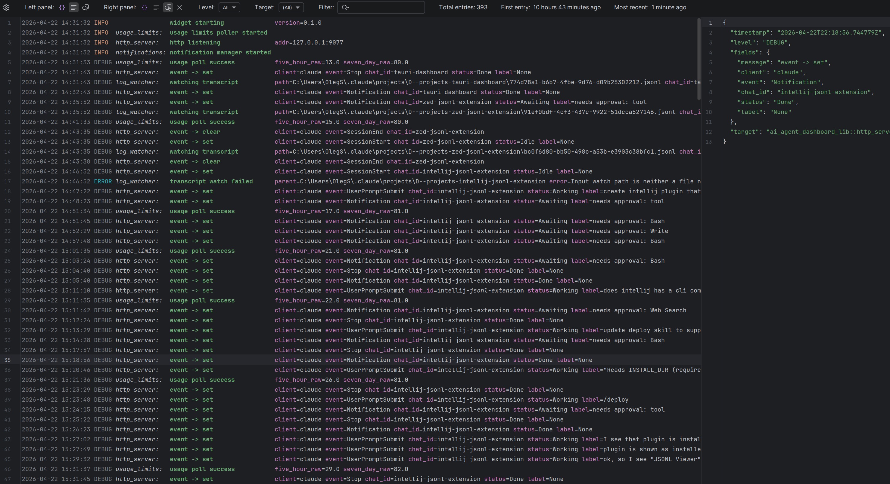
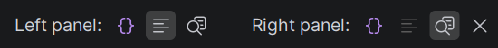
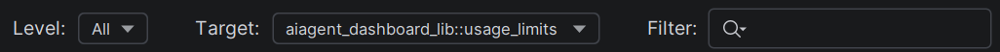
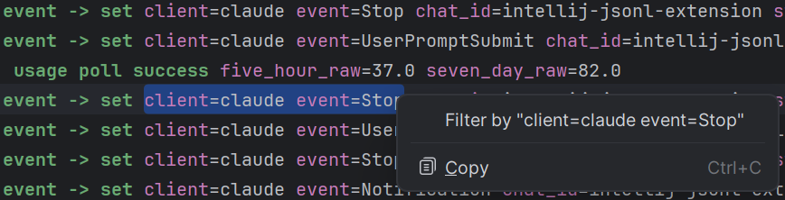
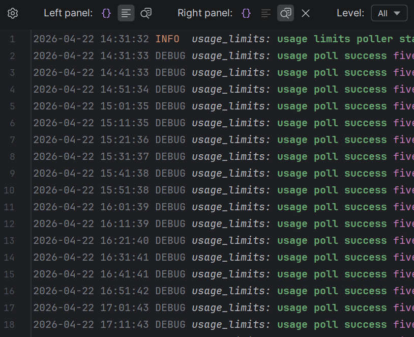
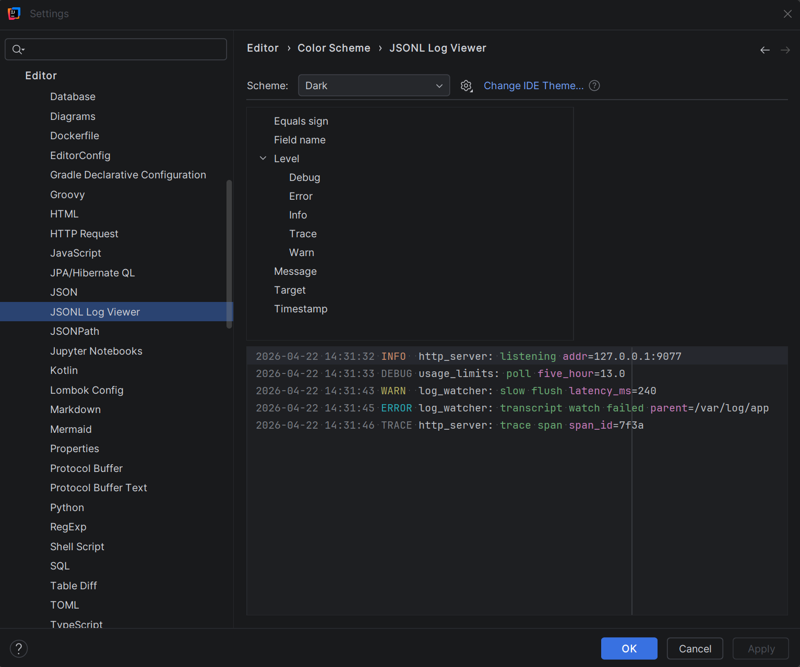
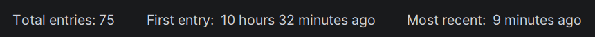

[Home](.) | [Usage](pages/usage) | [Development](pages/development)

---

*An IntelliJ Platform plugin that renders `.jsonl` (JSON-per-line) structured log files as human-readable log lines in a side-by-side split view, with filters, highlighting, and a JSON inspector for the current entry.*

Turn any `.jsonl` file into a readable log stream without post-processing. Each line becomes `<local-timestamp> <level> <target>: <message> <k=v> ...` with severity colours, aligned targets, and a live caret-driven inspector showing the pretty-printed JSON of the current entry.

<a href="screenshots/main-large.png"></a>

## Example

Given a line like:

```json
{"timestamp":"2026-04-22T21:43:38.033084Z","level":"DEBUG","fields":{"message":"event -> clear","client":"claude","event":"SessionEnd","chat_id":"zed-ext"},"target":"ai_agent_dashboard_lib::http_server"}
```

the plugin displays it as:

```
2026-04-22 21:43:38 DEBUG http_server: event -> clear client=claude event=SessionEnd chat_id=zed-ext
```

with the severity label coloured, target italicized, message bolded, field keys tinted, and timestamp/`=` dimmed. Every colour is customizable through the IDE's Color Scheme.

## Install

Build the plugin from source — see the [Developer guide](pages/development) for JDK / Gradle prerequisites and the install-from-disk workflow. The plugin only depends on `com.intellij.modules.platform`, so it works in every IntelliJ-based IDE: IntelliJ IDEA (Community + Ultimate), PyCharm, WebStorm, Rider, GoLand, CLion, DataGrip, RubyMine, RustRover, PhpStorm.

## [Usage](pages/usage)

Open any `.jsonl` file and the plugin renders it as a two-pane split editor. Each pane independently shows the raw JSON, formatted log lines, or a pretty-printed JSON inspector that tracks the caret in the other pane. Three independent filters (severity threshold, exact target, case-insensitive substring) compose freely; right-click selection to **Filter by**. A gear popup provides quick toggles for every rendering option, and ten semantic colour keys are exposed through the IDE's **Color Scheme** editor.



Three filters compose independently — minimum severity, exact target, case-insensitive text substring. The text filter matches against either the raw JSON or the rendered line so you find entries whether or not the formatter has prettified a value.



Right-click selected text → **Filter by "..."** to populate the text filter instantly.



Every rendering toggle is reachable from the gear popup in the toolbar.



Ten semantic colour keys are registered with the IDE's **Color Scheme** editor; defaults derive from platform palette entries so the plugin adapts to every theme automatically.



The plugin defaults to the Rust `tracing_subscriber::fmt::json` layout. Five dotted-path settings adapt it to pino, Serilog, bunyan, OpenTelemetry, or any other JSON-per-line format. See the full [Usage guide](pages/usage) for pane layouts, filter behaviour, stats, and field mappings.

## Usage

1. Open a `.jsonl` file — it opens in the split editor automatically.
2. Pick panes from the toolbar (Left / Right). Defaults remember per file.
3. Use the **Level** / **Target** / **Filter** dropdowns to narrow the view. Click any line to drive the Inspect pane.
4. Right-click highlighted text → **Filter by "..."** to populate the text filter.
5. Gear icon → **Open full settings...** to adjust rendering toggles, field mappings, and colours globally.


