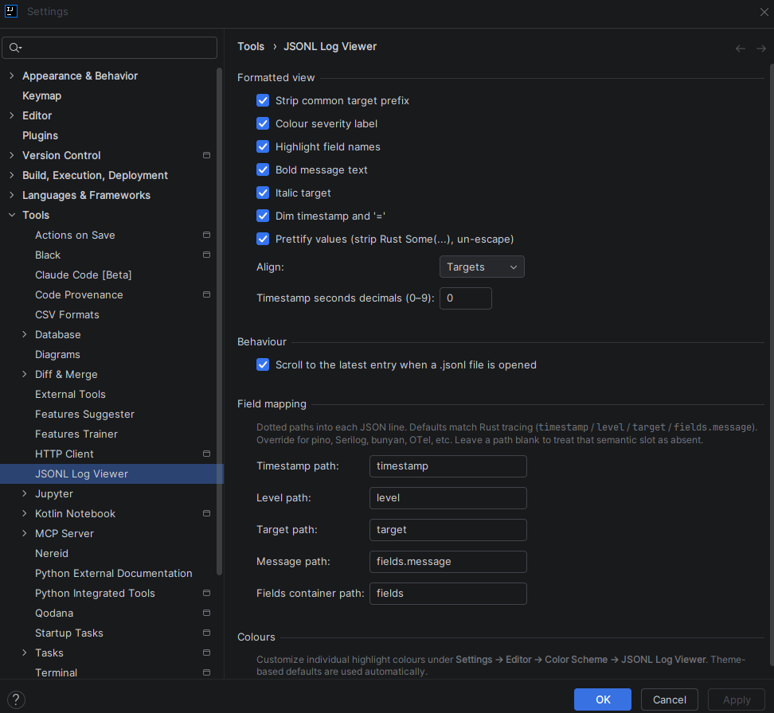

[Home](..) | [Usage](usage) | [Development](development)

---

The JSONL Log Viewer plugin adds a two-pane split editor for every `.jsonl` file you open in any IntelliJ-based IDE. The left pane shows human-readable formatted log lines, the right pane inspects the JSON of the entry at the caret, and a toolbar on top gives you pane selectors, filters, and live stats.

## Installation

Build the plugin zip with `gradle buildPlugin` (see the [Developer guide](development) for prerequisites), then install it in IntelliJ:

**Settings → Plugins → ⚙ → Install plugin from disk…** → select `build/distributions/intellij-jsonl-extension-<version>.zip` → restart IDE.

The plugin is platform-level — it works in every IntelliJ-based IDE (IntelliJ IDEA, PyCharm, WebStorm, Rider, GoLand, CLion, DataGrip, …) because it only depends on `com.intellij.modules.platform`.

## Opening `.jsonl` files

Any file with a `.jsonl` extension opens in the split editor automatically. On first open the plugin registers `.jsonl` as plain text so the raw side gets a sensible default file type; you can override the association in **Settings → Editor → File Types** without losing the split view (the editor is bound on extension, not file type).

## Editor layout

The editor is a two-pane split. Each pane independently shows one of:

| Pane content | Description |
|---|---|
| **Raw** | The raw `.jsonl` lines (filtered when a filter is active) |
| **Formatted** | Human-readable reformatted log lines with highlighting |
| **Inspect** | Pretty-printed JSON of the entry at the caret line in the other pane |
| **Off** *(right side only)* | Hide this pane, show the other full-width |

Defaults: **Left = Formatted, Right = Inspect**. Both sides remember your last choice per `.jsonl` file, with a fallback to the last-used-anywhere.

Pick a side's pane using the icon buttons in the toolbar:

The pane that's already selected on the left is **disabled** on the right group, so you can't show the same thing in both panes.

## Inspect mode

When a pane is set to Inspect, its sibling pane drives it via caret position. Click a line in the formatted (or raw) pane, and the Inspect pane updates to the pretty-printed JSON of that entry — with JSON syntax highlighting if the JSON plugin is available in your IDE (it is in IntelliJ IDEA).

The line-index ↔ raw-line mapping works correctly across filters: if you filter to 8 `ERROR` entries out of 500 lines, clicking on "Formatted line 3" shows the pretty JSON of the 3rd matching entry — not raw line 3.

## Filters

Three independent filters live in the toolbar between the pane selectors and the stats:

### Level filter (minimum severity)

Drop-down with `All / Trace / Debug / Info / Warn / Error`. Acts as a **minimum threshold** — `Info` shows `INFO`, `WARN`, `ERROR`; entries without a `level` field are dropped when any threshold is active.

### Target filter (exact match)

Drop-down populated from every distinct `target` value in the file (independent of current filters, so you can always switch). Selecting `(All)` clears the filter. Selecting a specific target keeps only entries with that exact `target` value.

### Text filter (case-insensitive substring)

Case-insensitive substring. An entry matches if the text appears in either its raw JSON or its formatted rendering — so searching for `Some(13.0)` finds entries whose raw JSON contains `Some(13.0)` even if prettify has stripped it to `13.0` in the display.

Typing debounces 200 ms.

## Filter by selection

Right-click selected text in the Raw, Formatted, or Inspect pane → **Filter by "…"** (top of the context menu). The selection is written into the text filter and applied immediately, skipping the debounce.

The right-click menu on the read-only viewer panes is intentionally minimal — just "Filter by" and "Copy" — no code-edit clutter.

## Stats

To the right of the filters:

- **Total entries** — count of non-blank lines in the visible (filtered) subset
- **First entry** — timestamp of the earliest entry in the visible subset
- **Most recent** — timestamp of the latest entry in the visible subset

Click on either "First entry" or "Most recent" to toggle between **relative** (`3 minutes ago`) and **absolute** (`Wed, Apr 22 17:00`) format. The choice is remembered per file.

Relative thresholds:

| Elapsed | Display |
|---|---|
| 0–14 s | `just now` |
| 15–59 s | `less than a minute ago` |
| 1–59 min | `N minute(s) ago` |
| 1–23 h | `N hour(s) M minute(s) ago` (minutes omitted when 0) |
| ≥ 1 day | `N day(s) M hour(s) ago` (hours omitted when 0) |

The most-recent label auto-refreshes every 30 s so "2 minutes ago" walks forward as wall-clock time advances.

## Gear popup (quick toggles)

The gear icon at the very left of the toolbar opens a popup containing:

- Every rendering toggle from the Settings page (Strip common prefix, Colour severity, Highlight field names, Bold message, Italic target, Dim timestamp/`=`, Prettify values)
- Scroll to latest on open
- Four Align radio items (None / Targets / Messages / Fields)
- **Open full settings…** — opens the Settings dialog directly at the JSONL Log Viewer page

All gear-popup toggles and the Settings page share state, so flipping any toggle immediately repaints every open JSONL editor.

## Settings page

**File → Settings → Tools → JSONL Log Viewer**

### Formatted view

| Setting | Default | Effect |
|---|---|---|
| Strip common target prefix | **on** | Remove the longest common target segment from the display (`ai_agent_dashboard_lib::http_server` → `http_server`) |
| Colour severity label | **on** | Color the level token (`ERROR`, `WARN`, etc.) using the theme's palette |
| Highlight field names | **on** | Color the `key` portion of every `key=value` pair |
| Bold message text | **on** | Bold font for the `fields.message` portion |
| Italic target | **on** | Italic font for the target + trailing `:` |
| Dim timestamp and `=` | **on** | Subdued color for the timestamp and `=` separators |
| Prettify values | **on** | Strip Rust Debug `Some(...)` wrappers and un-escape `\"` / `\\` inside debug-quoted strings. Values containing backslashes (paths) render raw |
| Align | **Targets** | Alignment level: `None / Targets / Messages / Fields`. Cascading — each level includes the previous |
| Timestamp seconds decimals | **0** | Integer 0–9 for the fractional-seconds precision |

Alignment cascade:

| Level | Pads |
|---|---|
| **None** | nothing |
| **Targets** | pads severity label so targets line up |
| **Messages** | above + pads target block so messages line up |
| **Fields** | above + pads message text so first `key=value` lines up |

All padding widths are computed from the **filtered subset** so alignment stays tight regardless of what's currently visible.

### Behaviour

| Setting | Default | Effect |
|---|---|---|
| Scroll to the latest entry when a `.jsonl` file is opened | **off** | Move caret to the last non-blank line on open |

### Field mapping

See [Field-mapping reference](#field-mapping-reference) below.

### Colours

Pointer to **Settings → Editor → Color Scheme → JSONL Log Viewer**, which is where individual colours are customised.

## Color Scheme integration

**Settings → Editor → Color Scheme → JSONL Log Viewer**

Ten semantic colour keys, each independently customizable:

- **Timestamp**
- **Level / Error**, **Level / Warn**, **Level / Info**, **Level / Debug**, **Level / Trace**
- **Target**
- **Message**
- **Field name**
- **Equals sign**

Defaults derive from language-neutral palette entries, so the plugin adapts to every theme automatically. Overriding one key behaves exactly like overriding any other syntax colour — exports, imports, and scheme sharing all work.

## Field-mapping reference

The plugin defaults to the Rust `tracing_subscriber::fmt::json` layout. For other log libraries, change these five paths under **Settings → Tools → JSONL Log Viewer → Field mapping**. Paths are dot-separated JSON lookups (`fields.message` means "look up `fields`, then `message`"); empty path disables that semantic slot.

| Format | Timestamp | Level | Target | Message | Fields container |
|---|---|---|---|---|---|
| Rust tracing *(default)* | `timestamp` | `level` | `target` | `fields.message` | `fields` |
| pino | `time` | `level` | `name` | `msg` | *(blank)* |
| Serilog | `@t` | `@l` | `SourceContext` | `@mt` | *(blank)* |
| bunyan | `time` | `level` | `name` | `msg` | *(blank)* |
| OpenTelemetry Logs | `timestamp` | `severityText` | `attributes.code.namespace` | `body` | `attributes` |

When `fields container` is blank, every top-level JSON key that isn't consumed by the other four paths is rendered as a `key=value` pair. When it's set, only keys under that object are rendered, with the leaf consumed by `message` suppressed so you don't see the message duplicated.

## Features

- **Two-pane split editor** with independent per-pane content (Raw / Formatted / Inspect / Off)
- **Caret-driven Inspect pane** showing pretty-printed JSON of the current entry
- **Severity / target / text filters** composing independently, with 200 ms debounce on text input
- **Filter by selection** context action on any pane
- **Gear popup** with every rendering toggle plus an Open-full-settings shortcut
- **Live stats** — total entries, first / most recent timestamps, toggleable relative ↔ absolute
- **Align cascade** — None / Targets / Messages / Fields, recomputed on the filtered subset
- **Prettify values** — strip Rust Debug wrappers, un-escape debug-quoted strings
- **Custom field mapping** — dotted paths for pino / Serilog / bunyan / OpenTelemetry / anything else
- **Ten colour-scheme keys** — customize through the IDE's Color Scheme editor

## Standard features

- Works in every IntelliJ-based IDE (IntelliJ IDEA, PyCharm, WebStorm, Rider, GoLand, CLion, DataGrip, RubyMine, RustRover, PhpStorm)
- Per-file state: pane selection, filters, and time-display mode persist across IDE restarts
- Global settings: rendering toggles, field mapping, and alignment persist per IDE install
- Live updates: changing any setting re-renders every open JSONL editor immediately
- No data leaves your machine — the plugin reads local files and does not make network calls
