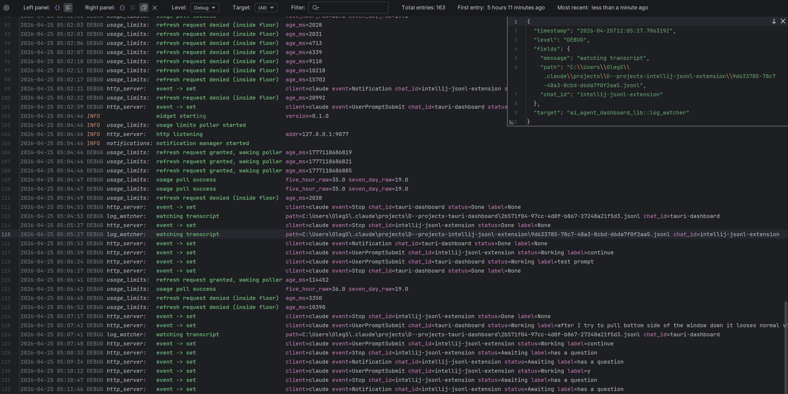

The JSONL Log Viewer plugin adds a two-pane split editor for every `.jsonl` file you open in any IntelliJ-based IDE. The left pane shows human-readable formatted log lines, the right pane inspects the JSON of the entry at the caret, and a toolbar on top gives you pane selectors, filters, and live stats.

## Installation

Build the plugin and install it from disk — see the [Developer guide](development#setup) for the full workflow and prerequisites.
