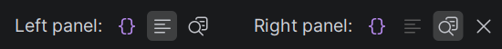

Any file with a `.jsonl` extension opens in the split editor automatically. On first open the plugin registers `.jsonl` as plain text so the raw side gets a sensible default file type; you can override the association in **Settings → Editor → File Types** without losing the split view (the editor is bound on extension, not file type).

The editor is a two-pane split. Each pane independently shows one of:

| Pane content | Description |
|---|---|
| **Raw** | The raw `.jsonl` lines (filtered when a filter is active) |
| **Formatted** | Human-readable reformatted log lines with highlighting |
| **Inspect** *(right side only — floating overlay)* | Pretty-printed JSON of the entry at the caret line, anchored to the top-right or bottom-right corner of the editor |
| **Off** *(right side only)* | Hide this pane, show the other full-width |

Defaults: **Left = Formatted, Right = Inspect**. Both sides remember your last choice per `.jsonl` file, with a fallback to the last-used-anywhere.

Pick a side's pane using the icon buttons in the toolbar:

The pane that's already selected on the left is **disabled** on the right group, so you can't show the same thing in both panes. Inspect is exposed only on the right because it renders as an overlay on top of the left pane — the left pane always shows Raw or Formatted.
