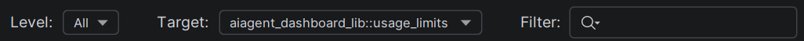
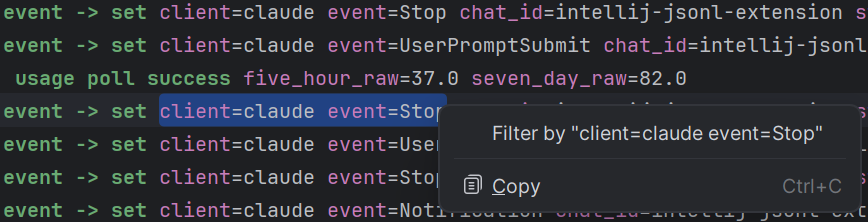

Three independent filters live in the toolbar between the pane selectors and the stats:

## Level filter (minimum severity)

Drop-down with `All / Trace / Debug / Info / Warn / Error`. Acts as a **minimum threshold** — `Info` shows `INFO`, `WARN`, `ERROR`; entries without a `level` field are dropped when any threshold is active.

## Target filter (exact match)

Drop-down populated from every distinct `target` value in the file (independent of current filters, so you can always switch). Selecting `(All)` clears the filter. Selecting a specific target keeps only entries with that exact `target` value.

## Text filter (case-insensitive substring)

Case-insensitive substring. An entry matches if the text appears in either its raw JSON or its formatted rendering — so searching for `Some(13.0)` finds entries whose raw JSON contains `Some(13.0)` even if prettify has stripped it to `13.0` in the display.

Typing debounces 200 ms.

## Filter by selection

Right-click selected text in the Raw, Formatted, or Inspect pane → **Filter by "…"** (top of the context menu). The selection is written into the text filter and applied immediately, skipping the debounce.

The right-click menu on the read-only viewer panes is intentionally minimal — just "Filter by" and "Copy" — no code-edit clutter.
