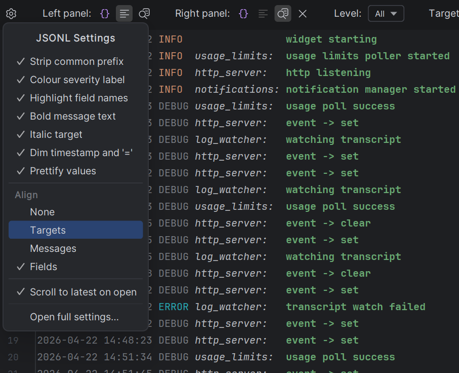
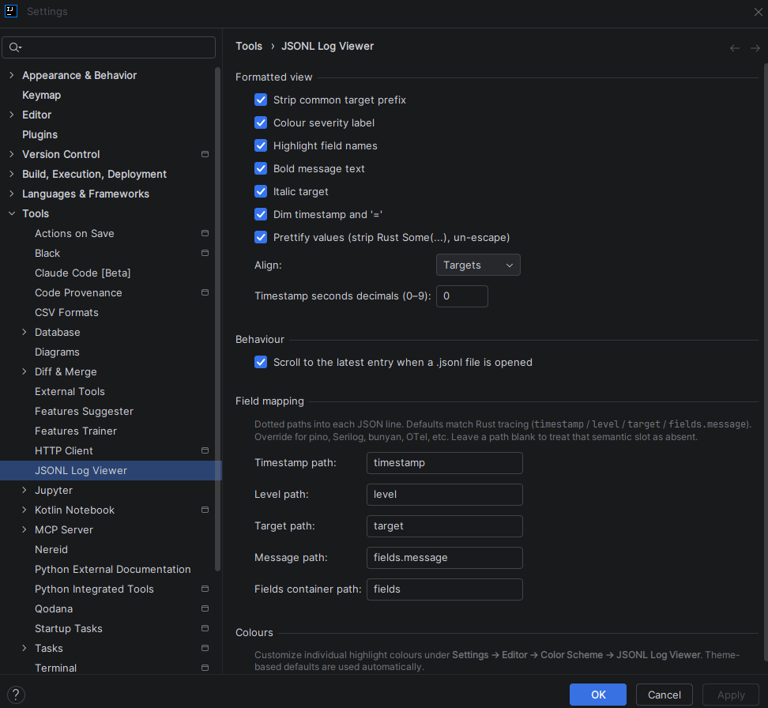
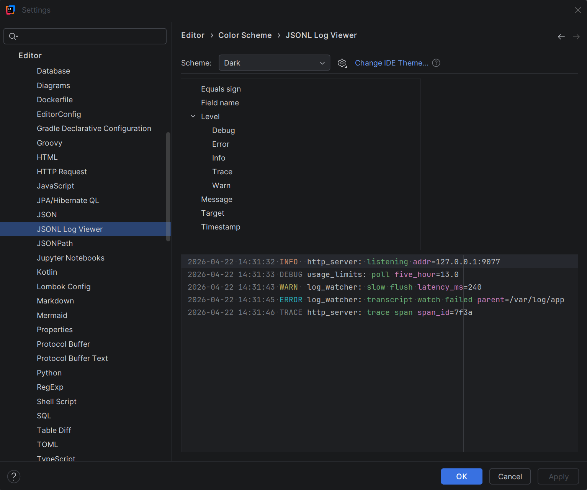

## Gear popup (quick toggles)

The gear icon at the very left of the toolbar opens a popup containing:

- Every rendering toggle from the Settings page (Strip common prefix, Colour severity, Highlight field names, Bold message, Italic target, Dim timestamp/`=`, Prettify values)
- Scroll to latest on open
- Auto-resize inspect height (auto-fit the inspect overlay's height to the current entry)
- Soft wrap inspect text (wrap long JSON values to the overlay's width instead of overflowing)
- Soft wrap formatted text (wrap long formatted log lines to the editor width)
- Four Align radio items (None / Targets / Messages / Fields)
- **Open full settings…** — opens the Settings dialog directly at the JSONL Log Viewer page

All gear-popup toggles and the Settings page share state, so flipping any toggle immediately repaints every open JSONL editor.

## Settings page

**File → Settings → Tools → JSONL Log Viewer**

### Formatted view

| Setting | Default | Effect |
|---|---|---|
| Strip common target prefix | **on** | Remove the longest common target segment from the display (`ai_agent_dashboard_lib::http_server` → `http_server`) |
| Colour severity label | **on** | Color the level token (`ERROR`, `WARN`, etc.) using the theme's palette |
| Highlight field names | **on** | Color the `key` portion of every `key=value` pair |
| Bold message text | **on** | Bold font for the `fields.message` portion |
| Italic target | **on** | Italic font for the target + trailing `:` |
| Dim timestamp and `=` | **on** | Subdued color for the timestamp and `=` separators |
| Prettify values | **on** | Strip Rust Debug `Some(...)` wrappers and un-escape `\"` / `\\` inside debug-quoted strings. Values containing backslashes (paths) render raw |
| Align | **Targets** | Alignment level: `None / Targets / Messages / Fields`. Cascading — each level includes the previous |
| Timestamp seconds decimals | **0** | Integer 0–9 for the fractional-seconds precision |

Alignment cascade:

| Level | Pads |
|---|---|
| **None** | nothing |
| **Targets** | pads severity label so targets line up |
| **Messages** | above + pads target block so messages line up |
| **Fields** | above + pads message text so first `key=value` lines up |

All padding widths are computed from the **filtered subset** so alignment stays tight regardless of what's currently visible.

### Behaviour

| Setting | Default | Effect |
|---|---|---|
| Scroll to the latest entry when a `.jsonl` file is opened | **off** | Move caret to the last non-blank line on open |
| Auto-resize inspect height | **off** | When the inspect overlay is shown, recompute its vertical size on every caret move so the current entry's pretty-printed JSON fits exactly. Width and corner stay user-controlled |
| Soft wrap inspect text | **on** | Wrap long JSON values inside the inspect overlay to its width instead of overflowing. When auto-resize is on, wrapped continuations count toward the height so wrapped lines stay fully visible |
| Soft wrap formatted text | **on** | Wrap long formatted log lines to the editor width. Under **Align = Fields** (where every line's first `=` lands at the same column), wrap continuations align with the column where the first field-value begins; under other alignments, continuations start at column 0 |

### Field mapping

See [Field-mapping reference](field-mapping).

### Colours

Pointer to **Settings → Editor → Color Scheme → JSONL Log Viewer**, which is where individual colours are customised.

## Color Scheme integration

**Settings → Editor → Color Scheme → JSONL Log Viewer**

Ten semantic colour keys, each independently customizable:

- **Timestamp**
- **Level / Error**, **Level / Warn**, **Level / Info**, **Level / Debug**, **Level / Trace**
- **Target**
- **Message**
- **Field name**
- **Equals sign**

Defaults derive from language-neutral palette entries, so the plugin adapts to every theme automatically. Overriding one key behaves exactly like overriding any other syntax colour — exports, imports, and scheme sharing all work.
