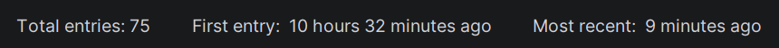

To the right of the filters:

- **Total entries** — count of non-blank lines in the visible (filtered) subset
- **First entry** — timestamp of the earliest entry in the visible subset
- **Most recent** — timestamp of the latest entry in the visible subset

Click on either "First entry" or "Most recent" to toggle between **relative** (`3 minutes ago`) and **absolute** (`Wed, Apr 22 17:00`) format. The choice is remembered per file.

Relative thresholds:

| Elapsed | Display |
|---|---|
| 0–14 s | `just now` |
| 15–59 s | `less than a minute ago` |
| 1–59 min | `N minute(s) ago` |
| 1–23 h | `N hour(s) M minute(s) ago` (minutes omitted when 0) |
| ≥ 1 day | `N day(s) M hour(s) ago` (hours omitted when 0) |

The most-recent label auto-refreshes every 30 s so "2 minutes ago" walks forward as wall-clock time advances.
